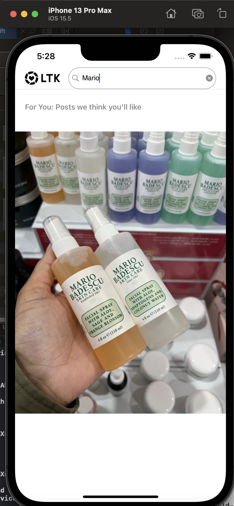
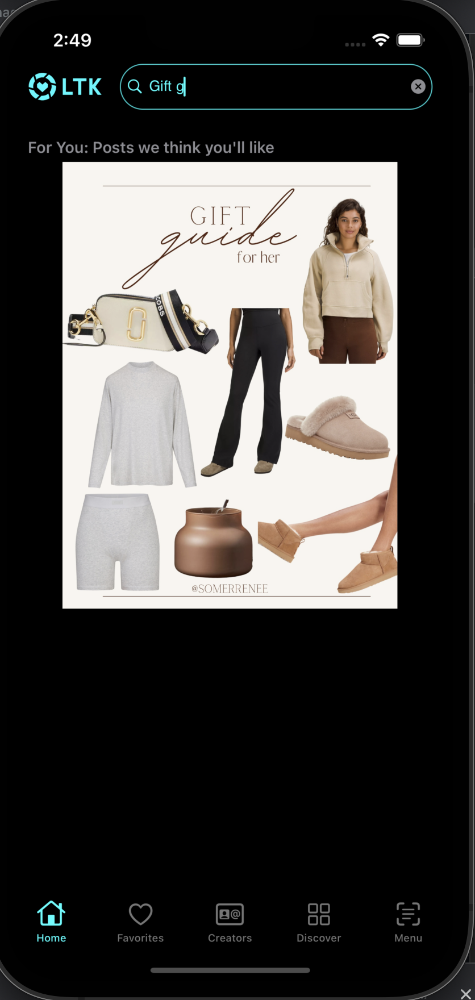
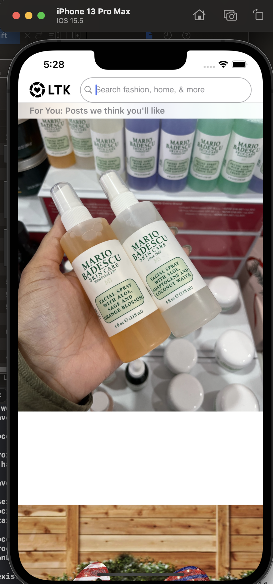
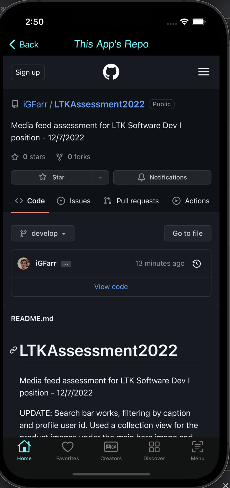

# LTKAssessment2022
Media feed assessment for LTK Software Dev I position - 12/7/2022

UPDATE: Search bar works, filtering by caption and profile user id. Used a collection view for the product images under the main hero image and profile image bubble. UI constraints could use some work, may return to this tonight if I have time to clean it up.

UPDATE2: Just realized I was supposed to implement pagination on that initial tableview. Will address that tonight!

  
   

  
   

